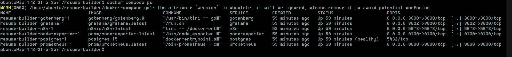
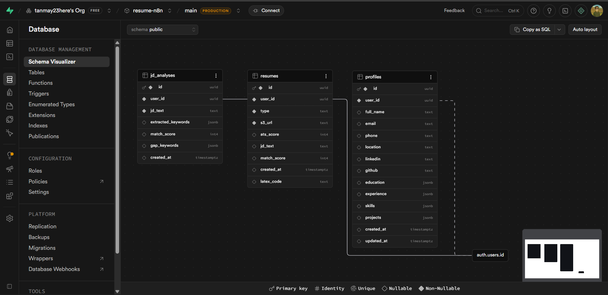
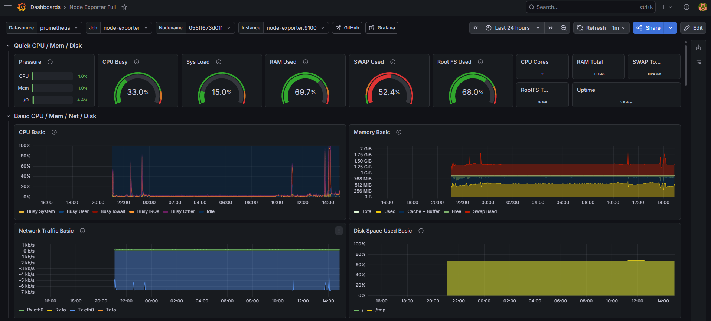
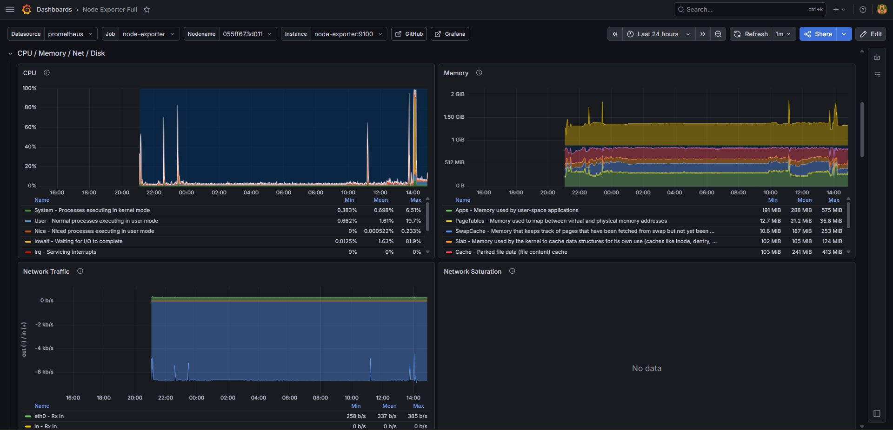

# Resume Builder

AI-powered, ATS-friendly resume generator built on AWS.

## Table of Contents

1. [Introduction](#introduction)
2. [Architecture Diagram](#architecture-diagram)
3. [Tech Stack](#tech-stack)
4. [Steps to Deploy](#steps-to-deploy)
5. [Summary](#summary)

---

## Introduction

Resume Builder is a full-stack cloud application that generates ATS-optimized resumes and tailors them to specific job descriptions using AI. Users authenticate through the web application, manage their profile, and trigger two core workflows:

- **Base Resume Generation** — produces a structured, ATS-friendly resume from a user profile using NVIDIA NIM AI with an iterative ATS scoring loop until a score of 90 or above is achieved.
- **JD-Tailored Resume** — analyzes a target job description, performs keyword gap analysis against the user profile, and produces a resume tailored to that specific role.

The frontend collects user input and delegates AI and document generation to n8n workflows. Generated PDFs are compiled from LaTeX via the YtoTech API and stored in Amazon S3. The entire platform runs as Docker containers managed by Docker Compose on a single AWS EC2 instance, with GitHub Actions handling automated deployment on every push to the master branch and Prometheus and Grafana providing system observability.

---

## Architecture Diagram


---

## Tech Stack

| Layer | Technology |
|---|---|
| Frontend | Next.js 16 (App Router), React 19, TypeScript, Tailwind CSS |
| Authentication | Supabase (`@supabase/ssr`) |
| Database | Supabase (PostgreSQL) — user profiles and resume metadata |
| Workflow engine | n8n (self-hosted) |
| n8n internal DB | PostgreSQL 15 |
| AI model | NVIDIA NIM — Llama 3.3 Nemotron Super 49B |
| PDF generation | YtoTech LaTeX API (compiles LaTeX to PDF) |
| Reverse proxy | Nginx |
| Object storage | AWS S3 |
| Compute | AWS EC2 t2.micro |
| Monitoring | Prometheus, Grafana, Node Exporter |
| Infrastructure as Code | Terraform (EC2, S3, IAM, security group) |
| Containerization | Docker, Docker Compose |
| CI/CD | GitHub Actions |

---

## Steps to Deployservices

### Prerequisites

Before starting, ensure you have the following ready on your local machine:

- AWS account (free tier) with programmatic access — Access Key ID and Secret Access Key
- AWS CLI installed and configured
- Terraform installed (`terraform -v` to verify)
- Docker Desktop installed and running
- Node.js 20 installed (`node -v` to verify)
- Git installed
- A Supabase project created at supabase.com — note the project URL, anon key, and service role key
- A NVIDIA NIM API key from build.nvidia.com
- An EC2 key pair named `resume-builder-key` — download the `.pem` file

---

### Local Machine — Step 1: Clone the Repository

```bash
git clone https://github.com/tanmay23here/resume-builder.git
cd resume-builder
```

---

### Local Machine — Step 2: Run Locally with Docker Compose

Create a `.env` file in the project root:

```bash
POSTGRES_PASSWORD=yourStrongPassword
N8N_ENCRYPTION_KEY=yourRandomKey32Chars
EC2_PUBLIC_IP=localhost
NVIDIA_API_KEY=nvapi-xxxxxxxxxxxx
AWS_ACCESS_KEY_ID=your-iam-access-key
AWS_SECRET_ACCESS_KEY=your-iam-secret-key
S3_BUCKET_NAME=resume-builder-pdfs-yourname
S3_REGION=ap-south-1
SUPABASE_URL=https://yourproject.supabase.co
SUPABASE_SERVICE_ROLE_KEY=your-service-role-key
NEXT_PUBLIC_SUPABASE_URL=https://yourproject.supabase.co
NEXT_PUBLIC_SUPABASE_ANON_KEY=your-anon-key
GRAFANA_PASSWORD=yourGrafanaPassword
```

Start all backend services:

```bash
docker compose up -d
docker compose ps
```

Start the frontend separately:

```bash
cd frontend
cp .env.local.example .env.local
# Fill in NEXT_PUBLIC_SUPABASE_URL, NEXT_PUBLIC_SUPABASE_ANON_KEY, N8N_BASE_URL=http://localhost:5678
npm install
npm run dev
```

Access the application locally:

- Frontend: `http://localhost:3001`
- n8n: `http://localhost:5678`
- Grafana: `http://localhost:3002`



---

### Local Machine — Step 3: Create Supabase Tables

Go to your Supabase project dashboard and open the SQL Editor. Run the following:

```sql
create table profiles (
  id uuid primary key default gen_random_uuid(),
  user_id uuid references auth.users(id) on delete cascade not null,
  full_name text, email text, phone text, location text,
  linkedin text, github text,
  education jsonb default '[]',
  experience jsonb default '[]',
  skills jsonb default '[]',
  projects jsonb default '[]',
  created_at timestamptz default now(),
  updated_at timestamptz default now()
);

create table resumes (
  id uuid primary key default gen_random_uuid(),
  user_id uuid references auth.users(id) on delete cascade not null,
  type text check (type in ('base', 'jd_tailored')) not null,
  s3_url text not null,
  ats_score integer,
  match_score integer,
  created_at timestamptz default now()
);

alter table profiles enable row level security;
alter table resumes enable row level security;

create policy "Users can manage own profile"
  on profiles for all using (auth.uid() = user_id);

create policy "Users can manage own resumes"
  on resumes for all using (auth.uid() = user_id);
```

Also go to Authentication → Providers → Email and disable "Confirm email" for development.



---

### Local Machine — Step 4: Create S3 Bucket

Go to AWS Console → S3 → Create Bucket:

- Bucket name: `resume-builder-pdfs-yourname` (must be globally unique)
- Region: `ap-south-1` (Mumbai)
- Disable all Block Public Access options
- Add this bucket policy (replace the bucket name):

```json
{
  "Version": "2012-10-17",
  "Statement": [
    {
      "Sid": "PublicReadGetObject",
      "Effect": "Allow",
      "Principal": "*",
      "Action": "s3:GetObject",
      "Resource": "arn:aws:s3:::resume-builder-pdfs-yourname/*"
    }
  ]
}
```

Create an IAM user named `resume-builder-n8n` with `AmazonS3FullAccess` and save the access key and secret key.


---

### Local Machine — Step 5: Import and Configure n8n Workflows

Open n8n at `http://localhost:5678` and complete the initial account setup.

Import both workflows:

- Click `+` → Import from file
- Upload `n8n-workflows/01 - Base Resume Generator.json`
- Open the workflow and update all hardcoded values in the Code nodes:
  - NVIDIA API key
  - Supabase URL and service role key
  - S3 bucket name and region
- Activate the workflow using the toggle in the top right
- Repeat for `n8n-workflows/02 - JD Tailored Resume.json`

Test Workflow 1 with curl:

```bash
curl -X POST http://localhost:5678/webhook/base-resume \
  -H "Content-Type: application/json" \
  -d "{\"user_id\":\"550e8400-e29b-41d4-a716-446655440000\",\"profile\":{\"full_name\":\"Test User\",\"email\":\"test@test.com\",\"skills\":[\"Docker\",\"Kubernetes\",\"AWS\",\"Terraform\"],\"experience\":[{\"company\":\"Tech Corp\",\"role\":\"DevOps Engineer\",\"description\":\"Managed Kubernetes clusters on AWS EKS\"}],\"education\":[{\"institution\":\"Mumbai University\",\"degree\":\"B.Tech\",\"field\":\"CS\"}],\"projects\":[]}}"
```


---

### EC2 — Step 6: Launch EC2 Instance

Go to AWS Console → EC2 → Launch Instance:

- Name: `resume-builder`
- AMI: Ubuntu Server 22.04 LTS
- Instance type: `t2.micro` (free tier)
- Key pair: `resume-builder-key` (use the one you already have)
- Storage: 20 GB gp3

In the security group, open these inbound ports:

| Port | Purpose |
|---|---|
| 22 | SSH |
| 80 | Nginx / HTTP |
| 3000 | Gotenberg |
| 3001 | Next.js frontend |
| 3002 | Grafana |
| 5678 | n8n |
| 9090 | Prometheus |
| 9100 | Node Exporter |

---

### EC2 — Step 7: Install Docker on EC2

SSH into the instance:

```bash
chmod 400 ~/Downloads/resume-builder-key.pem
ssh -i ~/Downloads/resume-builder-key.pem ubuntu@YOUR_EC2_IP
```

Install Docker:

```bash
sudo apt update && sudo apt upgrade -y
curl -fsSL https://get.docker.com -o get-docker.sh
sudo sh get-docker.sh
sudo usermod -aG docker ubuntu
sudo apt install -y docker-compose-plugin

# Add swap memory — critical for t2.micro with 1GB RAM
sudo fallocate -l 1G /swapfile
sudo chmod 600 /swapfile
sudo mkswap /swapfile
sudo swapon /swapfile
```

Exit and re-SSH, then verify:

```bash
docker --version
docker compose version
```

---

### EC2 — Step 8: Deploy the Stack

Create the project folder and clone the repository:

```bash
mkdir -p ~/resume-builder
cd ~/resume-builder
git clone https://github.com/tanmay23here/resume-builder.git app
```

Fix ownership:

```bash
sudo chown -R ubuntu:ubuntu ~/resume-builder/app
```

Create the `.env` file in `~/resume-builder/`:

```bash
nano ~/resume-builder/.env
```

Paste all environment variables from Step 2, replacing `localhost` with your EC2 public IP for `EC2_PUBLIC_IP`.

Create `prometheus.yml` in `~/resume-builder/`:

```yaml
global:
  scrape_interval: 15s

scrape_configs:
  - job_name: 'prometheus'
    static_configs:
      - targets: ['localhost:9090']

  - job_name: 'node-exporter'
    static_configs:
      - targets: ['node-exporter:9100']

  - job_name: 'n8n'
    static_configs:
      - targets: ['n8n:5678']
    metrics_path: '/metrics'
```

Start all services:

```bash
cd ~/resume-builder
docker compose up -d
docker compose ps
```

---

### EC2 — Step 9: Deploy Frontend with systemd

Build and set up the frontend as a system service:

```bash
cd ~/resume-builder/app/frontend

# Create environment file
cat > .env.local << 'EOF'
NEXT_PUBLIC_SUPABASE_URL=https://yourproject.supabase.co
NEXT_PUBLIC_SUPABASE_ANON_KEY=your-anon-key
N8N_BASE_URL=http://localhost:5678
EOF

npm install
npm run build
```

Create a systemd service:

```bash
sudo nano /etc/systemd/system/frontend.service
```

Paste:

```ini
[Unit]
Description=Resume Builder Frontend
After=network.target

[Service]
Type=simple
User=ubuntu
WorkingDirectory=/home/ubuntu/resume-builder/app/frontend
ExecStart=/usr/bin/npm start
Restart=always
RestartSec=10
Environment=PORT=3001
Environment=HOSTNAME=0.0.0.0

[Install]
WantedBy=multi-user.target
```

Enable and start:

```bash
sudo systemctl daemon-reload
sudo systemctl enable frontend
sudo systemctl start frontend
sudo systemctl status frontend
```

Verify the frontend is running:

```bash
curl http://localhost:3001
```

Open `http://YOUR_EC2_IP:3001` in your browser — the login page should appear.

---

### EC2 — Step 10: Import Workflows to Production n8n

Open `http://YOUR_EC2_IP:5678` in your browser and set up the n8n account.

Import both workflow JSON files from `n8n-workflows/` — same process as Step 5. Update all hardcoded credentials in the Code nodes with your production values and activate both workflows.

Test against the production EC2:

```bash
curl -X POST http://YOUR_EC2_IP:5678/webhook/base-resume \
  -H "Content-Type: application/json" \
  -d "{\"user_id\":\"550e8400-e29b-41d4-a716-446655440000\",\"profile\":{\"full_name\":\"Test User\",\"email\":\"test@test.com\",\"skills\":[\"Docker\",\"Kubernetes\",\"AWS\"],\"experience\":[],\"education\":[],\"projects\":[]}}"
```


---

### Local Machine — Step 11: Set Up GitHub Actions CI/CD

Add the following secrets to your GitHub repository under Settings → Secrets and variables → Actions → New repository secret:

| Secret | Value |
|---|---|
| `EC2_HOST` | Your EC2 public IP |
| `EC2_SSH_KEY` | Full contents of your `.pem` file including the header and footer lines |
| `NEXT_PUBLIC_SUPABASE_URL` | Your Supabase project URL |
| `NEXT_PUBLIC_SUPABASE_ANON_KEY` | Your Supabase anon key |

The CI/CD pipeline at `.github/workflows/deploy.yml` runs automatically on every push to master:

```
Push to master branch
        |
        v
GitHub Actions runner starts on ubuntu-latest
        |
        v  (Step 1 — Build)
SSH into EC2
git pull origin master
npm install
npm run build (Next.js production build)
        |
        v  (Step 2 — Restart)
SSH into EC2
Kill existing frontend process on port 3001
docker compose down
docker compose up -d (restarts n8n, postgres, gotenberg, nginx, prometheus, grafana)
systemctl restart frontend
        |
        v
Application live with latest changes
```

Push any change to trigger a test run:

```bash
echo "# test" >> README.md
git add . && git commit -m "test: trigger CI/CD" && git push origin master
```

Go to GitHub → Actions tab to watch the run.


---

### EC2 — Step 12: Set Up Grafana Monitoring

Open Grafana at `http://YOUR_EC2_IP:3002`:

- Username: `admin`
- Password: value of `GRAFANA_PASSWORD` from your `.env`

Add Prometheus as a data source:

- Left sidebar → Connections → Data Sources → Add new data source
- Select Prometheus
- URL: `http://prometheus:9090`
- Click Save and Test — should show a green success message

Import the Node Exporter dashboard:

- Left sidebar → Dashboards → New → Import
- Dashboard ID: `1860` → Load
- Select Prometheus as the data source → Import

This gives you live CPU, memory, disk, and network metrics for the EC2 instance.

Verify Prometheus targets are all up at `http://YOUR_EC2_IP:9090/targets`.




---

### Local Machine — Step 13: Provision with Terraform (Documentation)

The `infrastructure/` directory contains Terraform configuration that documents the entire AWS setup as code. This is provided for reproducibility and portfolio documentation — the EC2 and S3 resources were created manually above, but the Terraform files can be used to provision a fresh environment from scratch.

```bash
cd infrastructure
terraform init
terraform plan
```

Review the plan before applying to understand what resources will be created. The configuration provisions the EC2 instance, security group with all required ports, S3 bucket with public read policy, and IAM user with least-privilege S3 access.

---

## Summary

Resume Builder demonstrates a complete cloud engineering workflow applied to a real product. The key areas covered are:

**Cloud infrastructure** — The application runs on AWS using EC2 for compute and S3 for object storage, with the EC2 instance in Seoul and S3 in Mumbai. Infrastructure is fully documented as Terraform code for reproducibility.

**Containerization** — All backend services including n8n, Gotenberg, Nginx, PostgreSQL, Prometheus, and Grafana run as Docker containers orchestrated by Docker Compose. The Next.js frontend runs as a systemd service for reliable process management.

**CI/CD pipeline** — GitHub Actions automates deployment on every push to master. The pipeline SSHes into EC2, pulls latest code, rebuilds the frontend, restarts Docker services, and restarts the frontend systemd service without any manual intervention.

**AI workflow automation** — n8n orchestrates multi-step AI workflows using NVIDIA NIM's Llama 3.3 Nemotron model for resume generation, ATS scoring, and job description analysis. The ATS scoring loop calls the model iteratively until the resume achieves a score of 90 or above, up to a maximum of three iterations.

**Monitoring and observability** — Prometheus scrapes metrics from Node Exporter and n8n. Grafana provides dashboards for CPU, memory, disk, and network metrics, giving visibility into system health.

**Security** — IAM users follow the principle of least privilege with S3-only scoped permissions. Supabase Row Level Security ensures users can only read and write their own data. All secrets are stored as GitHub Actions secrets and EC2 environment variables, never committed to the repository.

The project is built entirely on free-tier services — AWS EC2 t2.micro, S3 free tier, Supabase free tier, and NVIDIA NIM free credits — making it a zero-cost demonstration of production-grade DevOps practices.